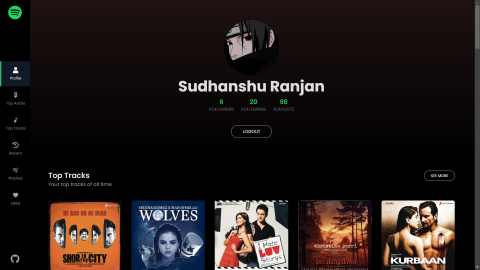

<h1 align="center"> 🎧 Mix.Me </h1>
  
  [](LICENSE)  []()  []()  []()  []()  []()

Why wait for Spotify wrapped to see your spotify stats?
SpotiStat is a web application that allows users to view their Spotify listening history and statistics. Users can view their top artists and tracks, as well as their listening history over the past 4 weeks, 6 months, and several years. Users can also view their top artists and tracks for each of these time periods. User can also view their top genres and the audio features of their top tracks. Users can also search for any artist, album, or track and view information about them. Users can also view their recently played tracks and their saved tracks and albums.

## Usage

To use SpotiStat, you must have a Spotify account. You can login to SpotiStat using your Spotify account. Once you are logged in, you can view your top artists and tracks, listening history, top genres, and audio features. 

### Live WebSite URL

The WebSite is deployed in https://mixme.vercel.app/
> [!IMPORTANT]  
> The project is currently invite only so for now you can't login to the website. But you can still clone the project and run it locally. If you want to log in to deployed project, I will need your `Spotify Name` and `Spotify EmailID` to invite you.

<br/>



### Features

- View your profile(name, image, followers, following, top genre)
- View your top artists, tracks
- View the audio features of your top tracks
- Search for artists, albums, playlists and tracks
- View information about artists, playlists, albums, and tracks
- View your recently played tracks
- View your saved tracks, albums, playlists
- View your created playlists, and view information about them
- Follow and unfollow playlists/users/artists
- Get recommendations based on your playlist and create a new playlist based on these recommendations
- Install it in your computer/phone since it is a PWA.

## Tech Stack

### Project has following functionalities

- Creating a Component in ReactJs
- Making HTTP calls (using Axios & React-Query)
- Communicating between parent and child component
- Using Basic Routing in React
- Using Tailwind for Styling
- Creating a NodeJS server using Express

### Preqrequisites

#### Install Node JS
Refer to https://nodejs.org/en/ to install nodejs

#### Install TypeScript
Refer to https://www.typescriptlang.org/ to install typescript

```bash
npm install -g typescript
```

#### Install vite
Install Vite npm package globally. This will help to easily run the project and also build the source files easily. Use the following command to install vite

```bash
npm install -g vite
```

#### Learn Tailwind CSS
This project uses `Tailwind CSS` if you don't have any hands-on experience with tailwind css then you can refer to their [docs](https://tailwindcss.com/).

#### Learn React JS
If you are new to React JS then you can refer to their [docs](https://react.dev/).

#### Learn React Query
If you are new to React Query then you can refer to their [docs](https://appwrite.io/docs).

## Cloning and Running the Application in local

- Clone the project into local.
 - In the `root folder` and type the following command to install all npm packages
    ```bash
    npm install
    ```
- Go to `client folder` and type the following command to install all npm packages
    ```bash
    npm install
    ```
- In `client folder`, Change the `.env.example` file to `.env` and add the required credentials.
    ```bash
    VITE_API_URL=http://localhost:8080
    ```
- Go to `server folder` and type the following command to install all npm packages
    ```bash
    npm install
    ```
- In server folder, Change the `.env.example` file to `.env` and add the required credentials.
    ```bash
    CLIENT_ID=<Spotify Client ID>
    CLIENT_SECRET=<Spotify Client Secret>
    FRONTEND_URL=http://localhost:5173
    REDIRECT_URI=http://localhost:8080/callback
    ```
  You can get the `CLIENT_ID` and `CLIENT_SECRET` from [Spotify Developer Dashboard](https://developer.spotify.com/dashboard/) by creating an app.

  In spotify developer dashboard, in newly created app, add `http://localhost:8080/callback` as the redirect uri.

> [!WARNING]  
> In order to run the application, Run the following command in the **root directory** only.

```bash
 npm run dev
```

- The Frontend Runs on [http://localhost:5173/](http://localhost:5173/).
- The Backend Runs on [http://localhost:8080/](http://localhost:8080/).

`Contributions are welcome 🎉🎉`
# Contributing
If you would like to contribute to SpotiStat, please open an issue or pull request on GitHub

## Ways to contribute:

1. Solve the issues which are listed.
2. Create your own issue and then send PR.

Please refer to the project's style and contribution guidelines for submitting patches and additions. In general, we follow the "fork-and-pull" Git workflow.

 1. **Fork** the repo on GitHub
 2. **Clone** the project to your own machine
 3. **Commit** changes to your own branch
 4. **Push** your work back up to your fork
 5. Submit a **Pull request** so that we can review your changes


### 🚀 Please abide by  [**Contributing Guidelines**](https://github.com/SudhansuuRanjan/SpotiStat/blob/main/CONTRIBUTING.md) and [**Code of Conduct**](https://github.com/SudhansuuRanjan/SpotiStat/blob/main/CODE_OF_CONDUCT.md).


## Contributors ✨

Thanks goes to these wonderful people ❤️:

<a href = "https://github.com/SudhansuuRanjan/SpotiStat/graphs/contributors">
  
</a>
